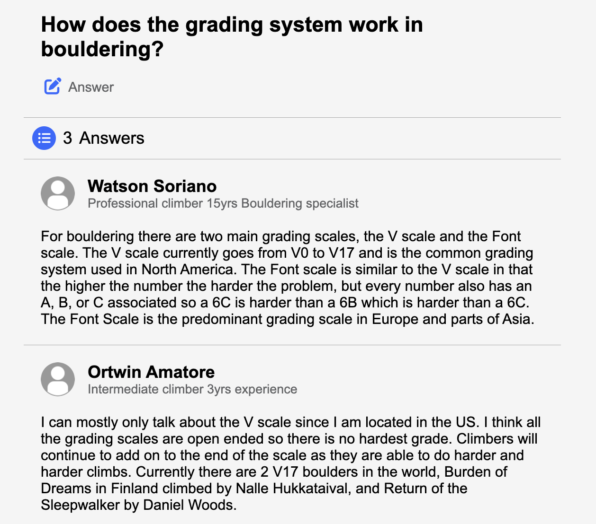
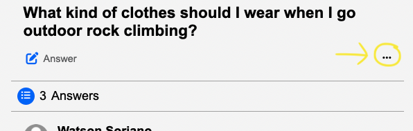
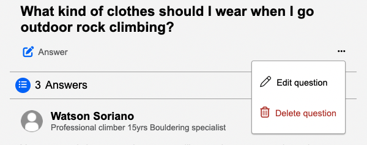
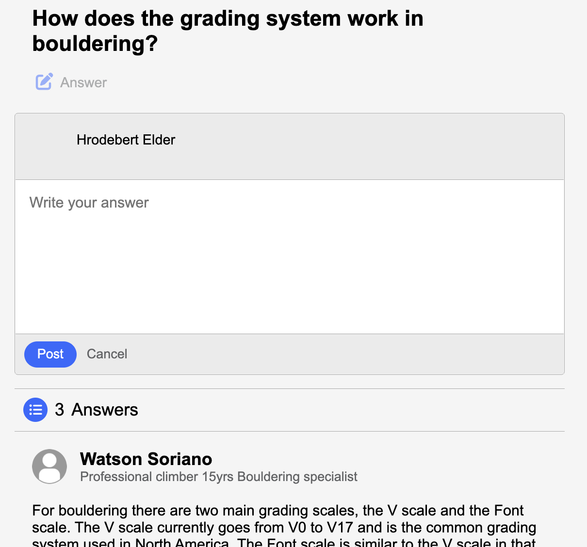
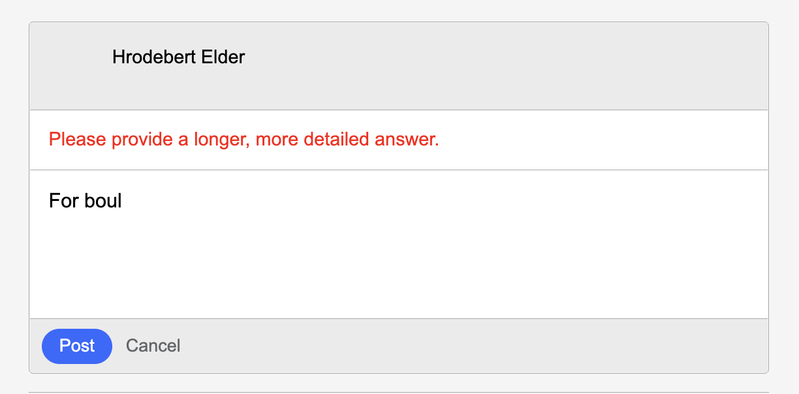
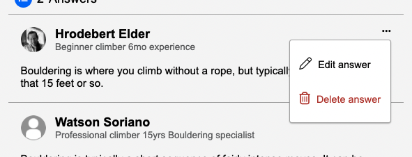
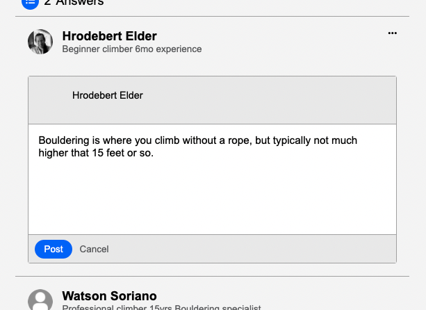

# climbOn
ClimbOn, a full-stack application inspired by Quora, is a question and answer forum dedicated to all climbing related topics. If you want to know about climbing, climbOn is the place to go. Users can ask climbing questions related to whatever they're curious about or even find answers to questions they didn't know they had! Users can also go on and share their knowlege of climbing by answering any number of questions.

[Visit the site live here!](https://climb-on-capstone-app.herokuapp.com/)

* [MVP Feature List](https://github.com/Noslepr/climbOn-quora-clone/wiki/Feature-List)
* [User Stories](https://github.com/Noslepr/climbOn-quora-clone/wiki/User-Sotries)
* [Database Schema](https://github.com/Noslepr/climbOn-quora-clone/wiki/Database-Schema)

# Technologies Used
*  --- Amzon web services
*  --- Python
*  --- Flask
*  --- React
*  --- Redux
*  --- HTML
*  --- CSS
*  --- Node
*  --- PostgresQL
*  --- SQLAlchemy
*  --- JavaScript
*  --- Docker

# Getting Started

1. Clone the repository

       git@github.com:Noslepr/climbOn-quora-clone.git

2. CD into the /app directory and install dependencies

        pipenv install

3. CD into the /react-app directory and install dependencies

        npm install

4. Create a .env file based on the example with proper settings for your development environment

5. Setup your PostgreSQL user, password and database and verify that it matches your .env file

6. Start your shell, migrate your database, seed your database, and run the flask app

        pipenv shell

        flask db upgrade

        flask seed all

        flask run

7. Create your AWS user and bucket:

      -Create a bucket:

        (https://s3.console.aws.amazon.com/s3/home?region=us-east-1)

      -Create a user with `programmatic access` by navigating to:

        (https://console.aws.amazon.com/iam/home?#/users)

      -Set up a security policy for your user: 'Attach existing policies directly' => 'Create Policy'

      -Click the `JSON tab` and set a policy:

          {
           "Version": "2012-10-17",
           "Statement": [
             {
               "Sid": "Stmt1420751757000",
               "Effect": "Allow",
               "Action": ["s3:*"],
               "Resource": "arn:aws:s3:::<NAME OF BUCKET>/*"
             }
           ]
          }

      -Now update your .env with your `S3_BUCKET`, `S3_KEY`, `S3_SECRET`

8. Open another terminal and change directory into /react-app and run the React app

          npm start

# Site Tour

## Splash Page
Here users can log in with an existing account, sign-up for an account, or login as a demo user to explore the site.

### Sign-up

- When you click on the signup with email button, the sign-up modal will popup.
- The sign-up form has error validation for each required field.

## Home Page
The home page is where the user will be navigated to after initial login. Here they will be shown a list of questions that will be randomized each time they navigate home.

## Navigation Bar
The Nav bar is visable from every part of the site once you are logged in.

1. Here is the climbOn logo. When clicked, the user will be navigated back to the home page.
2. Here is the search bar. The user can use this to search for questions.
3. Here is the profile image. When clicked, a dropdown will appear to give the user more navigation options.
4. This is the add question button. When clicked, a modal will pop up for the user to ask their question.

### Search
- When the search bar is in focus it expands and shows a list of questions that fit the search criteria.
- The user can click on any of the questions to be navigated to the specific question page.
- The user can also click on the search prefill to be navigated to a list of questions that fit the search criteria

### Profile Dropdown
- Here the user can see their profile image and profile name.
- If the user hovers over their profile image they will see an edit button. When clicked, they can upload a new image to change their profile image. They can also click on the 'Edit Your Profile Image' button for the same effect.
- The user can click on 'Your Questions' button to navigate to all questions that user has posted.
- The logout button is used to logout from their account.
- At the bottom of the profile dropdown are links to the developers LinkedIn and GitHub.

---------

### Add Question
- When the user clicks on the 'add question' button, a modal will pop up where they can ask their question.
- If the user tries to submit a question that does not meet the site's validation, error messages will show what needs to be corrected.

--

## Question Page
To naviage to the question page, all the user needs to do is click on a question on the home page, the search bar dropdown, or the search results page. Here they will see all of the answers that were posted for this question. This is also where the user can answer the question themselves.

### Edit and Delete ellipsis
- If the specific question navigated to belongs to the logged in user, the 3 dots ellipsis will appear.
- Clicking on the ellipsis will provide a dropdown to give the option for the user to edit or delete the question.
- Editing the question will bring up a modal that prefills the field with the relevant question. It has the same error handling that posting a question has.
- Deleting the question will redirect the user to the home page.

### Answer Box
- If the user clicks on the answer button below the question, an answer box will show up where they can share their knowledge by providing their answer to the given question.
- If the user provides too short of an answer, they won't be able to submit and will be asked to provide a more detailed answer.
- The error message works dynamically so it will go away once the answer has reached a sufficient length.

--

### Edit/Delete Answer
- If any of the answers listed under a question belong to the logged in user, the edit/delete ellipsis will appear.
- If the user chooses to edit their answer, an answer box will appear, prefilled with the previous answer.
- Editing your answer has the same error validation as posting an answer. It also works dynamically so the error message goes away when the answer has reached a sufficient length.
- Deleting your answer will make your answer disappear from the list of answers.

--
